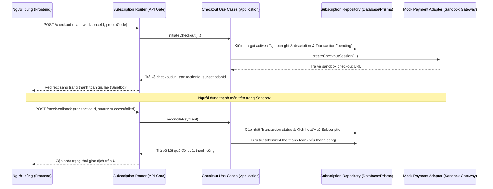

# Đánh Giá & Review Chi Tiết Tính Năng Thanh Toán Và Đăng Ký (Subscription & Payment)

Tài liệu này cung cấp cái nhìn toàn diện và phân tích kỹ thuật về tính năng **Thanh toán & Đăng ký (Subscription & Payment)** thuộc hệ thống **Virtual Company Platform (VCP)**.

---

## 1. Tổng Quan Kiến Trúc (Architecture Overview)

Tính năng Subscription & Payment được xây dựng theo mô hình **Clean Architecture / DDD** kết hợp với kiến trúc **Modular Monolith** nhằm đảm bảo ranh giới rõ ràng giữa các module khác và đảm bảo tính mở rộng cao.

### Sơ đồ luồng hoạt động chính:

---

## 2. Phân Tích Các Luồng Nghiệp Vụ Cốt Lõi

### A. Quản Lý Gói Cước và Hạn Mức (Plans & Entitlements)
Các gói cước được định nghĩa tường minh trong file contract dùng chung [plans.ts](file:///c:/Users/NITRO/Documents/NMCNPM/2023_21_introduction_to_software_engineering/packages/shared/src/contracts/plans.ts):
- **Free ($0/tháng):** 2 CPU Cores, 4GB RAM, tối đa 2 Agents, 10 Documents, 10GB Storage.
- **Standard ($29/tháng):** 8 CPU Cores, 16GB RAM, tối đa 10 Agents, 100 Documents, 50GB Storage.
- **Premium ($79/tháng):** 32 CPU Cores, 64GB RAM, tối đa 50 Agents, 1000 Documents, 500GB Storage.

### B. Khởi Tạo Thanh Toán (initiateCheckout)
- **Ràng buộc hạ cấp:** Hệ thống chặn việc hạ cấp gói trực tiếp khi gói hiện tại đang hoạt động (`active`) hoặc đang chờ thanh toán (`pending`).
- **Ràng buộc mua trùng:** Chặn mua gói trùng lặp nếu gói đó đã tồn tại ở trạng thái hoạt động hoặc đang chờ thanh toán.
- **Tự động chuyển hướng nâng cấp:** Nếu người dùng đang dùng gói **Standard** và yêu cầu checkout gói **Premium**, hệ thống sẽ tự động chuyển đổi thành luồng nâng cấp (`initiateUpgrade`).

### C. Nâng Cấp Gói Cước (initiateUpgrade)
- Chỉ hỗ trợ nâng cấp từ **Standard** lên **Premium**.
- Tính toán chênh lệch giá (Proration chênh lệch giá gốc): Lấy giá gói Premium ($79) trừ giá gói Standard ($29) để ra số tiền thanh toán nâng cấp là **$50** (có áp dụng thêm Promo Code nếu có).
- Kích hoạt thời hạn sử dụng 30 ngày mới sau khi đối soát thành công.

### D. Đối Soát Thanh Toán (reconcilePayment)
- Nhận callback từ cổng thanh toán (qua webhook/callback).
- Hỗ trợ cơ chế **Idempotent** (nếu giao dịch đã xử lý rồi thì bỏ qua không xử lý lại).
- Nếu thanh toán **Thành công**:
  - Cập nhật trạng thái Subscription sang `active`.
  - Thiết lập ngày hết hạn mới (expiresAt = `now + 30 days`).
  - Gửi đi các Domain Event tương ứng: `subscription.activated` hoặc `subscription.upgraded` qua Event Bus để các module khác (như Workspace Provisioning, Mailer) tiêu thụ.
- Nếu thanh toán **Thất bại**:
  - Chuyển trạng thái Subscription ban đầu từ `pending` sang `cancelled`.

### E. Quản Lý Promo Code và Auto-Renewal
- **Mã giảm giá:** Hiện tại hỗ trợ mock các mã `VCP10` (giảm $10) và `VCP20` (giảm $20).
- **Tự động gia hạn:** Cho phép người dùng bật/tắt cờ `autoRenew` của gói đăng ký theo từng Workspace.

---

## 3. Phân Tích An Toàn Thông Tin & Tuân Thủ (Security & PCI-DSS)

Một điểm sáng cực kỳ lớn của hệ thống là thiết kế **Tuân thủ tiêu chuẩn bảo mật dữ liệu thẻ thanh toán (PCI-DSS Compliance)** nằm tại [prisma-subscription-repository.ts](file:///c:/Users/NITRO/Documents/NMCNPM/2023_21_introduction_to_software_engineering/apps/backend/src/modules/subscription-payment/infrastructure/prisma-subscription-repository.ts):

* **Không lưu trữ thông tin thẻ thô (Raw Card Data):** Số thẻ tín dụng đầy đủ của khách hàng không bao giờ được ghi vào bảng `Subscription` hay cơ sở dữ liệu chính.
* **Tokenization:** Khi người dùng cập nhật thông tin thẻ, hệ thống chỉ lưu trữ:
  1. 4 số cuối của thẻ (`last4`).
  2. Tên chủ thẻ (`holder`).
  3. Mã token đại diện đại lý (`gatewayToken`) được sinh ra từ cổng thanh toán mock.
* **Tách biệt bảng dữ liệu:** Thông tin thẻ tokenized được lưu trữ an toàn trong bảng `PaymentMethod` riêng biệt, liên kết qua `workspaceId`, thay vì lưu chung trong bản ghi gói cước.

---

## 4. Tích Hợp Chéo Tài Nguyên (Resource Entitlement Integration)

Module Subscription tự động tính toán lượng tài nguyên thực tế mà Workspace đang tiêu thụ qua hàm `getWorkspaceResourceUsage` bằng cách gọi chéo tới các repository của các module khác:
- **Agents:** Đếm số lượng agent có trạng thái khác `deleted` từ `AgentRepository` để tính toán CPU/RAM tiêu thụ thực tế (Công thức: `1 Agent = 1 Core CPU, 2GB RAM`).
- **Knowledge/RAG:** Đếm số lượng tài liệu từ `KnowledgeDocumentRepository` để tính dung lượng lưu trữ tiêu thụ thực tế (Công thức: `1 Document = 0.42GB Storage`).

Hệ thống so sánh lượng tiêu thụ thực tế này với hạn mức giới hạn (quota) của gói hiện tại để hiển thị trên UI giúp người dùng đưa ra quyết định nâng cấp kịp thời.

---

## 5. Thiết Kế Giao Diện Người Dùng (UI/UX)

Mã nguồn frontend tại [subscription-payment-page.tsx](file:///c:/Users/NITRO/Documents/NMCNPM/2023_21_introduction_to_software_engineering/apps/frontend/src/features/subscription-payment/subscription-payment-page.tsx) được thiết kế hiện đại, nhiều hiệu ứng động mượt mà và trực quan:
- **Biểu đồ tròn/thanh tài nguyên (Resource Usage Visualizer):** Biểu diễn tỷ lệ CPU Cores, RAM, Agent Slots, và Storage đã dùng so với hạn mức tối đa của gói hiện tại.
- **Trang Sandbox Checkout:** Mô phỏng cổng thanh toán trực quan với form nhập thông tin thẻ ảo để người dùng thực hiện giao dịch thử nghiệm nhanh chóng.
- **Lịch sử giao dịch (Billing History):** Danh sách hiển thị lịch sử các lần thanh toán kèm theo hóa đơn và trạng thái tương ứng.

---

## 6. Đánh Giá Khách Quan & Khuyến Nghị Nâng Cấp

### Điểm mạnh:
1. **Ranh giới module rõ ràng:** Mọi tương tác nghiệp vụ đều thông qua Use Cases và Contracts dùng chung, không import chéo lộn xộn.
2. **Thiết kế tuân thủ PCI-DSS tốt:** Sử dụng thẻ tokenized, hạn chế tối đa nguy cơ lộ dữ liệu nhạy cảm.
3. **Chế độ dự phòng InMemory tốt:** Khi không có PostgreSQL (Prisma), backend vẫn chạy mượt mà bằng Mock Repositories hỗ trợ tốt cho việc phát triển/test local.

### Điểm hạn chế cần nâng cấp:
1. **Promo Code bị Hardcode:** Logic kiểm tra promo code hiện tại nằm trực tiếp ở UseCase. Khuyến nghị đưa thông tin mã giảm giá vào cơ sở dữ liệu để có thể tạo/sửa/xóa động qua Admin Panel.
2. **Công thức tính Proration nâng cấp còn đơn giản:** Phí nâng cấp hiện tại chỉ tính bằng chênh lệch phẳng giữa hai gói (`Premium - Standard`), chưa tính đến thời gian sử dụng thực tế còn lại của tháng (ví dụ: đã dùng Standard được 15 ngày thì chỉ nên thu thêm phí nâng cấp cho 15 ngày còn lại).
3. **Thiếu Tích Hợp Cổng Thanh Toán Thực Tế:** Hệ thống mới chỉ có cổng Mock Sandbox. Cần tích hợp các SDK chính thức của Stripe, PayPal, hoặc VNPay/Momo bằng cách viết thêm các class Adapter mới kế thừa `PaymentAdapter`.
4. **Cơ chế Đồng Bộ Tài Nguyên RAG:** Việc giả định `1 Document = 0.42GB Storage` là một ước lượng tĩnh. Nên tích hợp thêm hàm tính dung lượng byte thực tế của file được tải lên trong module RAG.
